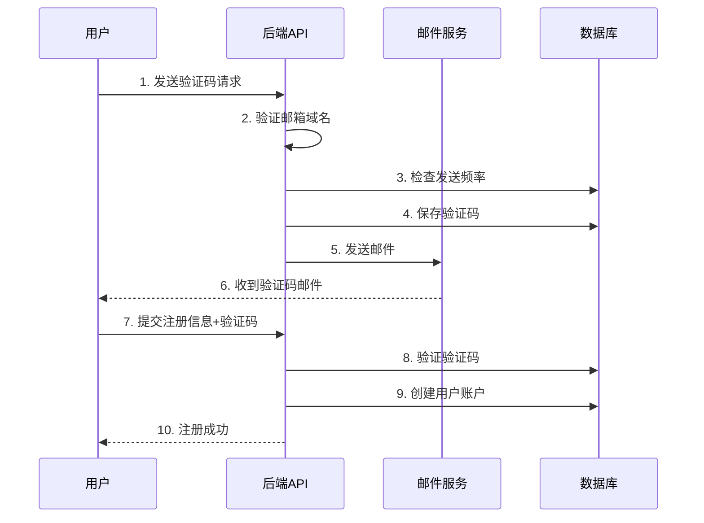

# 邮箱验证功能文档

## 概述

WALI平台现已支持邮箱验证注册功能，用户必须通过邮箱验证码才能完成注册。目前支持的邮箱域名有限，仅支持QQ邮箱和谷歌邮箱。

## 支持的邮箱域名

- `qq.com` - QQ邮箱
- `gmail.com` - 谷歌邮箱
- `googlemail.com` - 谷歌邮箱（部分地区）

## API 接口

### 1. 发送邮箱验证码

**接口地址：** `POST /auth/send-code`

**请求参数：**
```json
{
  "email": "string",      // 邮箱地址（必填）
  "type": "string"        // 验证类型，默认为 "register"
}
```

**请求示例：**
```json
{
  "email": "user@qq.com",
  "type": "register"
}
```

**成功响应：**
```json
{
  "success": true,
  "message": "验证码已发送到您的邮箱，请查收",
  "data": {
    "email": "user@qq.com",
    "expiresIn": 600
  }
}
```

**错误响应：**
```json
{
  "success": false,
  "message": "暂时只支持以下邮箱注册：qq.com, gmail.com, googlemail.com",
  "allowedDomains": ["qq.com", "gmail.com", "googlemail.com"]
}
```

**错误码说明：**
- `400` - 邮箱格式错误或不支持的邮箱域名
- `429` - 验证码发送过于频繁（1分钟内只能发送一次）
- `500` - 邮件发送失败

### 2. 用户注册（需要验证码）

**接口地址：** `POST /auth/register`

**请求参数：**
```json
{
  "username": "string",    // 用户名（必填）
  "email": "string",       // 邮箱地址（必填）
  "password": "string",    // 密码（必填，至少6位）
  "emailCode": "string"    // 邮箱验证码（必填，6位数字）
}
```

**请求示例：**
```json
{
  "username": "testuser",
  "email": "user@qq.com",
  "password": "123456",
  "emailCode": "123456"
}
```

**成功响应：**
```json
{
  "success": true,
  "message": "用户注册成功，获得 100 tokens奖励",
  "data": {
    "user": {
      "id": 1,
      "username": "testuser",
      "email": "user@qq.com",
      "tokenBalance": 100
    },
    "token": "jwt_token_string",
    "tokenBonus": 100
  }
}
```

**错误响应：**
```json
{
  "success": false,
  "message": "验证码无效"
}
```

**错误码说明：**
- `400` - 参数缺失、邮箱域名不支持、验证码无效或已过期
- `500` - 服务器内部错误

## 验证码规则

### 生成规则
- **格式：** 6位随机数字
- **有效期：** 10分钟
- **发送频率：** 每个邮箱1分钟内只能发送一次
- **验证次数：** 每个验证码最多尝试3次

### 验证规则
- 验证码必须在有效期内使用
- 验证码只能使用一次，使用后自动失效
- 超过3次错误尝试后验证码失效

## 邮件模板

系统会发送美观的HTML邮件，包含：
- WALI平台logo和品牌信息
- 大字体显示的6位验证码
- 有效期提醒（10分钟）
- 安全提示信息

## 环境配置

需要在 `.env` 文件中配置SMTP邮件服务器信息：

```env
# SMTP 邮件服务器配置
SMTP_HOST=smtp.gmail.com
SMTP_PORT=587
SMTP_USER=your-email@gmail.com
SMTP_PASS=your-app-password
```

### Gmail 配置说明

如果使用Gmail作为SMTP服务器：

1. **启用两步验证**
2. **生成应用专用密码**
   - 访问 [Google账户设置](https://myaccount.google.com/)
   - 进入"安全性" → "两步验证" → "应用专用密码"
   - 生成新的应用专用密码
   - 将生成的密码填入 `SMTP_PASS`

3. **配置示例：**
```env
SMTP_HOST=smtp.gmail.com
SMTP_PORT=587
SMTP_USER=yourapp@gmail.com
SMTP_PASS=abcd1234efgh5678
```

## 数据库表结构

### email_verifications 表

| 字段名 | 类型 | 说明 |
|--------|------|------|
| id | INTEGER | 主键，自增 |
| email | VARCHAR(255) | 邮箱地址 |
| code | VARCHAR(6) | 6位验证码 |
| type | ENUM | 验证类型：register/login/reset_password |
| expiresAt | DATETIME | 过期时间 |
| used | BOOLEAN | 是否已使用 |
| attempts | INTEGER | 尝试次数 |
| createdAt | DATETIME | 创建时间 |
| updatedAt | DATETIME | 更新时间 |

## 使用流程



## 错误处理

### 常见错误及解决方案

1. **邮箱域名不支持**
   - 错误：`暂时只支持以下邮箱注册：qq.com, gmail.com, googlemail.com`
   - 解决：使用支持的邮箱域名

2. **验证码发送频繁**
   - 错误：`验证码发送过于频繁，请1分钟后再试`
   - 解决：等待1分钟后重新发送

3. **验证码无效**
   - 错误：`验证码无效`
   - 解决：检查验证码是否正确、是否过期、是否已使用

4. **邮件发送失败**
   - 错误：`邮件发送失败`
   - 解决：检查SMTP配置是否正确

## 安全考虑

1. **防暴力破解**
   - 限制验证码尝试次数（最多3次）
   - 限制发送频率（1分钟一次）

2. **防垃圾注册**
   - 限制支持的邮箱域名
   - 验证码有效期较短（10分钟）

3. **数据保护**
   - 验证码使用后立即失效
   - 定期清理过期的验证码记录

## 监控和日志

系统会记录以下事件：
- 验证码发送成功/失败
- 验证码验证成功/失败
- 邮箱域名验证失败
- SMTP服务器连接状态

建议监控：
- 验证码发送成功率
- 注册转化率
- 邮件服务器可用性